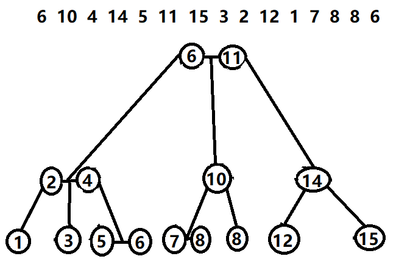

# 2-3树概述
---

### **2-3树是B树的一种**
---

- 必要条件:
  - 树中所有的叶子节点都在同一层

  - 有两个子节点的节点称为二节点, 二节点要么有两个子节点, 要么没有子节点, 不能只有一个子节点
  - 有三个子节点的节点称为三节点, 三节点要么有三个子节点, 要么没有子节点, 不能只有一个或两个子节点

- 按照这些必要条件, 将图中那串数字一个一个插入到树中, 最终形成图中那棵2-3树
