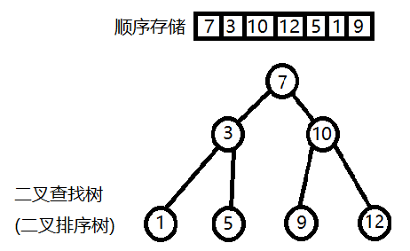

# 二叉查找树(二叉排序树)

---

- 二叉查找树的优势
  - 查找某个数比顺序存储要更加快速
  - 删除或插入某个数, 要更加方便
  - 总体来说数据的增删改查更加有**效率**

- 逻辑特点
  - **非叶子节点**的**左**子节点比当前节点**小**
  - **非叶子节点**的**右**子节点比当前节点**大**
- 一棵空树也是二叉查找树

---

- [创建二叉排序树](https://github.com/voidxiao/CODE/blob/master/%E6%A0%91%E7%9A%84%E6%93%8D%E4%BD%9C/%E5%88%9B%E5%BB%BA%E4%BA%8C%E5%8F%89%E6%8E%92%E5%BA%8F%E6%A0%91.c)
- [删除二叉排序树节点](https://github.com/voidxiao/CODE/blob/master/%E6%A0%91%E7%9A%84%E6%93%8D%E4%BD%9C/%E5%88%A0%E9%99%A4%E4%BA%8C%E5%8F%89%E6%8E%92%E5%BA%8F%E6%A0%91%E8%8A%82%E7%82%B9.c)
