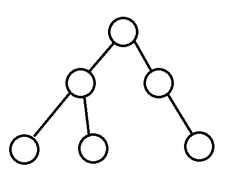
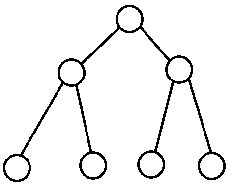
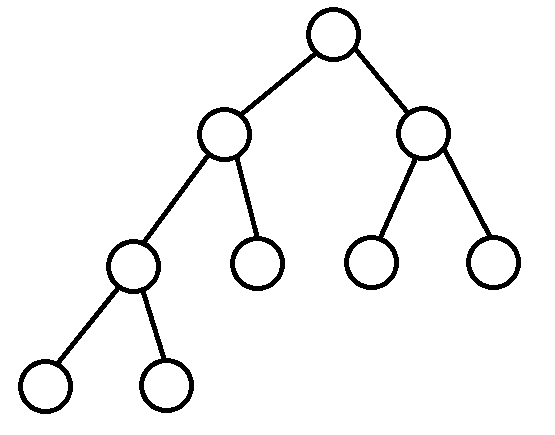
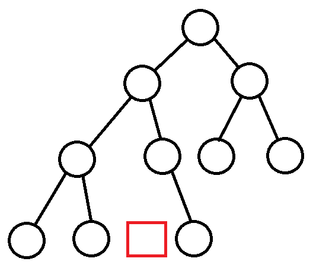
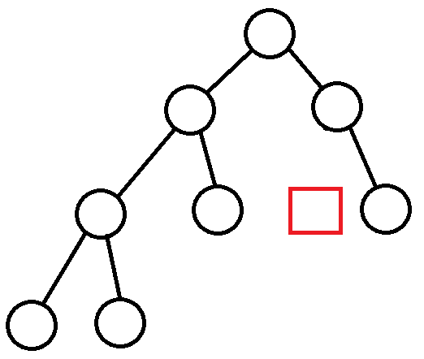

# 二叉树
---

- `每个节点的度都小于或等于二`
- `二叉树的节点分为左节点和右节点`
- `左节点和右节点不能颠倒顺序`
  - `当一棵树左节点为1, 右节点为0; 另一棵树左节点为0, 右节点为1; 这两棵树不是相同的树`

# 满二叉树
---

- `所有叶子节点都在最后一层`
- `满足节点的总数是2^n - 1`
  - `n是树的高度`

# 完全二叉树
---

- `叶子节点从左边往右边依次连续`
- `倒数第二层若有叶子节点, 那一定是连续集中在右边`
- `在完全二叉树中, 一个节点没有左子树, 那它一定没有右子树`
- `满二叉树是一颗特殊完全二叉树, 但完全二叉树不一定是满二叉树`
  - `满二叉树最后一层从右到左连续删除若干节点, 得到完全二叉树`

### 以下都不是完全二叉树
---

---

