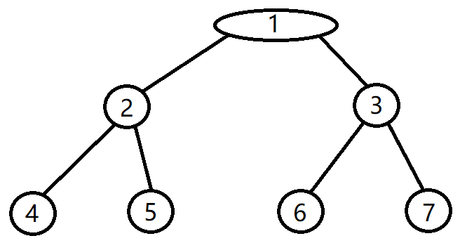

# 二叉树的前中后序遍历的递归思路
---

#### [二叉树的前中后序遍历示例代码](https://github.com/voidxiao/CODE/blob/master/%E6%A0%91%E7%9A%84%E6%93%8D%E4%BD%9C/%E4%BA%8C%E5%8F%89%E6%A0%91%E7%9A%84%E5%89%8D%E4%B8%AD%E5%90%8E%E5%BA%8F%E9%81%8D%E5%8E%86.c "查看二叉树的前中后序遍历代码示例")

## 1. 前序遍历




```c
//前序遍历  参数temp传根节点
void frontShow(TreeNode* temp)
{
	printf("%d ", temp->data);
	if (temp->left != NULL)
	{
		frontShow(temp->left);
	}
	if (temp->right != NULL)
	{
		frontShow(temp->right);
	}
}
```

**下面所说的1234567 既是节点的权也是节点的编号 如二叉树图**
- 首先, 进来函数
- `printf("%d ", temp->data)`直接就打印出1


- 此时因为`temp->left`是2号节点, 不为`NULL`, 所以执行`frontShow`函数, 传入`temp->left`参数, 就是把2号节点的地址传了进去
- 此时再次进来函数, `printf("%d ", temp->data)`打印出2, 2即是2号节点中的`data`
- 继续往下执行到`if`语句, 此时`temp->left`是4号节点, 不为NULL, 执行函数`frontShow`, 传入参数`temp->left`, 就是传了4号节点的地址
- 再次进来函数, 打印出4, `temp->left`为`NULL`, 不执行第一个`if`, 来到第二个`if`, `temp->right`也为`NULL`, 也不执行, 好了, 这个函数执行完了, 跳回到上一层递归
- 因为是上一层递归, 此时的`temp`是2号节点, `frontShow(temp->left)`执行完了, 所以接着执行下面的`if`, `temp->right`是5号节点的地址, 不为`NULL`, 所以执行函数`frontShow(temp->right)`, 传入的参数`temp->right`是5号元素
- 再次进来函数, 执行`printf`语句, 打印出5, `temp->left`和`temp->right`都为`NULL`, 所以函数执行完毕, 返回上一层递归
- 此时回到`temp`为2号节点的递归, 刚刚执行完`frontShow(temp->right)`, 所以这一层递归也执行完了, 返回上一层递归
- 此时回到`temp`为1号节点的递归, 刚刚执行完`frontShow(temp->left)`, 现在往下执行, 来到第二个`if`语句, `temp->right`是3号节点的地址, 不为`NULL`, 接下来执行`frontShow(temp->right)`
- 来到`temp`为3号节点地址的递归, 执行`printf语句`打印出3, 来到第一个`if`, `temp->left`是6号节点的地址, 不为空, 所以执行`frontShow(temp->left)`
- 来到`temp`为6号节点地址的递归, 执行`printf语句`打印出6, 来到第一个`if`, `temp->left`为`NULL`, 第二个`if`, `temp->right`为`NULL`, 好的, 函数退出, 返回上一层递归
- 此时回到`temp`为3号节点地址的递归, 刚刚执行完`frontShow(temp->left)`, 所以往下执行, 来到第二个`if`, `temp->right`是7号节点的地址, 不为`NULL`, 那么执行`frontShow(temp->right)`函数
- 来到`temp`为7号节点地址的递归, `printf语句`打印了7, `temp->left`和`temp->right`都为`NULL`, 所以函数直接返回
- 来到`temp`为3号节点地址的递归, 刚刚是因为执行完了`frontShow(temp->right)`才回到这一层递归, 所以从`frontShow(temo->right)`向下执行, 下面也没有, 这个递归也返回
- 这次回到了我们开始的地方, `temp`为1号节点地址, 我们是因为执行完了`frontShow(temp->right)`才回到了这里, 所以往下也执行完了, 整个递归就结束了

#### 输出了`1 2 4 5 3 6 7`
#### 这是一个正确的前序遍历结果
#### 中序和后序思路都一样
