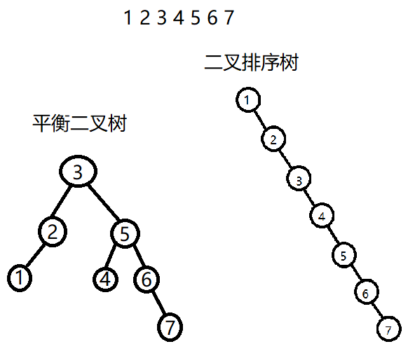

# 平衡二叉树(AVL树)

---

- 上面这个图展示了二叉排序树的缺点
  - 如果是这样的一组数, 那它的增删改查效率会大大降低 变得就像链表一样
  - 二叉排序树在插入数据时, 进行平衡调整, 形成的平衡二叉树, 效率会大大提升
  - 弥补了二叉排序树在处理某些数据时的短板
---
- **平衡二叉树本身基于二叉排序树**
- 平衡二叉树特点
  - 首先它是一棵**二叉排序树**
  - 其次**任何节点的左右子树**的高度差的绝对值不超过 1
