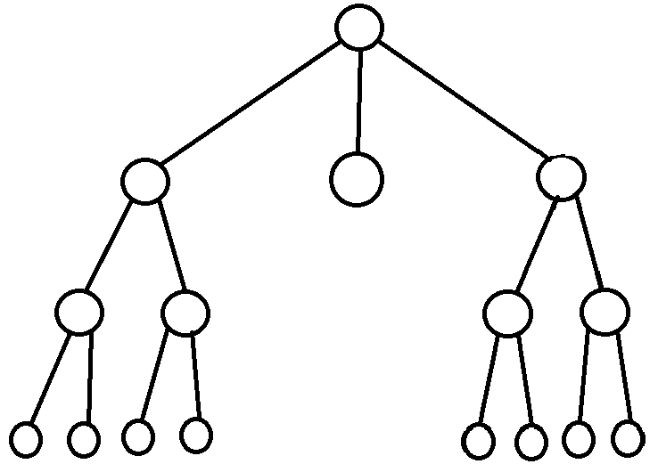

# 树的基本结构
---

- **根节点**: `没有父节点的节点`

- **双亲结点**: `一个节点的上一个节点, 就是这个节点的双亲结点`

- **子节点**: `一个节点的下一层节点, 就是该节点的子节点`

- **路径**: `一个节点到另外一个节点所经过的节点, 称为路径`

- **度**: `当一个节点有两个子节点, 那么它的度就是2`

- **权**: `相当于节点里的数据, 当一个节点存了一个1, 那它的权就是1`

- **叶子节点**: `没有子节点的节点成为叶子节点`

- **子树**: `把一个节点和它所有的子节点取下来, 它也是一个树结构, 那它就是子树`

- **层**: `根节点就是第一层, 它的子节点就是第二层, 以此类推, 就像楼层一样`

- **树的高度**: `树的高度就是树的最大层数, 如图中, 它的高度就是4`

- **森林**: `多颗互不相交的树的集合`
