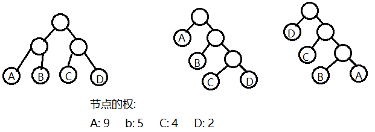

# 赫夫曼树概述
---

---

- 赫夫曼树也称为**最优二叉树**, 它是n个带权叶子节点构成的所有二叉树中, 带权路径长度**最小**的二叉树
- 叶子节点的带权路径
  - 根节点到叶子节点的路径数量 * 叶子节点的权
- 树的带权路径长度WPL(weighted path length)
  - 所有叶子节点的带权路径的总和
    - 上图第一棵二叉树WPL为: 2 * 9 + 2 * 5 + 2 * 4 + 2 * 2 = 40
    - 上图第二棵二叉树WPL为: 1 * 9 + 2 * 5 + 3 * 4 + 3 * 2 = 37
    - 上图第三棵二叉树WPL为: 1 * 2 + 2 * 4 + 3 * 5 + 3 * 9 = 52
    - WPL值最小的二叉树为最优二叉树
  - 权值**越大**的节点离根节点**越近**的二叉树才是最优二叉树

---
- [创建赫夫曼树](https://github.com/voidxiao/CODE/blob/master/%E6%A0%91%E7%9A%84%E6%93%8D%E4%BD%9C/%E5%88%9B%E5%BB%BA%E8%B5%AB%E5%A4%AB%E6%9B%BC%E6%A0%91.c)
