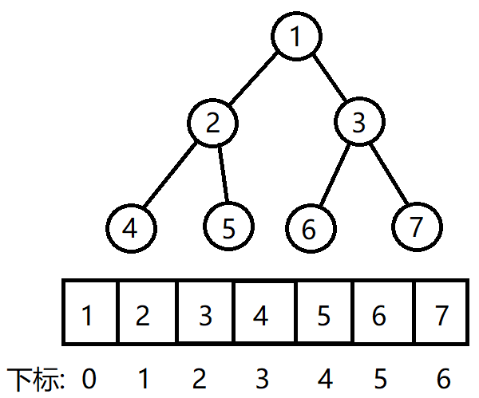

# 顺序二叉树概述
---

- 顺序二叉树通常情况下只考虑完全二叉树
- 查找子节点下标
  - 查找左子节点:`2 * n + 1`
  - 查找右子节点:`2 * n + 2`
  - `n`为父节点下标
- 查找父节点下标
  - 左右子节点通用方法`(n - 1) / 2`
  - `n`为子节点下标

---

[遍历顺序二叉树](https://github.com/voidxiao/CODE/blob/master/树的操作/遍历顺序二叉树.c)
